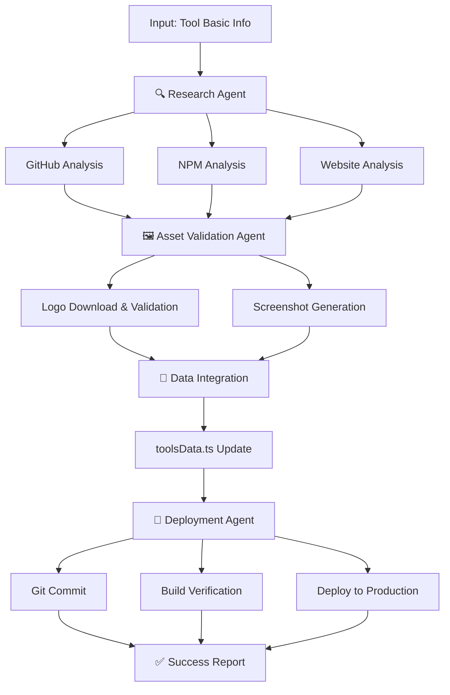

# 🤖 Sistema Agéntico para Adición de Herramientas

## 🎯 Visión General

Un sistema de 4 agentes especializados que trabajan en colaboración para añadir herramientas de manera completamente automatizada, inteligente y segura.

## 🎭 Los 4 Agentes Especializados

### 1. 🔍 Research Agent (Agente de Investigación)

**Responsabilidades:**
- Investiga información actualizada sobre la herramienta
- Analiza repositorio GitHub (stars, lenguaje, licencia)
- Revisa datos de NPM (descargas, versión, dependencias)
- Examina el website oficial (documentación, pricing)
- Identifica competencia y alternativas
- Analiza el ecosistema (integraciones, comunidad)

**Capacidades:**
- Web scraping inteligente
- GitHub API analysis  
- NPM registry data gathering
- Documentation structure analysis
- Pricing model detection
- Technology stack identification

**Salida:** Configuración completa de la herramienta con datos verificados

### 2. 🖼️ Asset Validation Agent (Agente de Validación de Assets)

**Responsabilidades:**
- Descarga logos de múltiples fuentes con fallbacks
- Genera screenshots optimizados (1200x675, 16:9)
- Valida formato y calidad de imágenes
- Convierte formatos si es necesario
- Ejecuta checks de calidad automáticos

**Capacidades:**
- Logo download and validation
- Screenshot generation and optimization  
- Image format conversion
- Quality assurance checks
- Asset optimization

**Salida:** Assets listos para producción con validación completa

### 3. 🚀 Deployment Agent (Agente de Despliegue)

**Responsabilidades:**
- Ejecuta git add, commit, push automático
- Genera mensajes de commit descriptivos e informativos
- Ejecuta build para verificar que no hay errores
- Maneja deployment a producción
- Implementa rollback si es necesario

**Capacidades:**
- Git commit with descriptive messages
- Branch management
- Build verification  
- Deployment to production
- Rollback capabilities

**Salida:** Despliegue completo con verificación de integridad

### 4. 🎭 Orchestrator Agent (Agente Coordinador)

**Responsabilidades:**
- Coordina secuencia completa de trabajo entre agentes
- Maneja errores y reintentos
- Genera reportes completos del workflow
- Integra datos en toolsData.ts
- Monitorea progreso y estado

**Capacidades:**
- Multi-agent coordination
- Error handling and recovery
- Workflow state management
- Comprehensive reporting
- Quality gate enforcement

## 🔄 Flujo de Trabajo Completo



## 🚀 Uso del Sistema

### Comando Principal

```bash
npm run add-tool:ai <id> <name> <category> <website> [github] [documentation]
```

### Ejemplos Prácticos

```bash
# Herramienta Frontend
npm run add-tool:ai vite "Vite" frontend "https://vitejs.dev" "https://github.com/vitejs/vite"

# Herramienta Backend  
npm run add-tool:ai fastify "Fastify" backend "https://fastify.io" "https://github.com/fastify/fastify"

# Herramienta DevOps
npm run add-tool:ai kubernetes "Kubernetes" devops "https://kubernetes.io" "https://github.com/kubernetes/kubernetes"

# Herramienta de Testing
npm run add-tool:ai playwright "Playwright" testing "https://playwright.dev" "https://github.com/microsoft/playwright"
```

### Comandos Alternativos

```bash
npm run add-tool:agentic  # Alias del workflow agéntico
npm run workflow:add-tool # Alias semántico
```

## 🎯 Ventajas del Sistema Agéntico

### ✅ Automatización Completa
- **Sin intervención manual**: De información básica a herramienta desplegada
- **Investigación automática**: Datos actualizados y verificados
- **Assets generados**: Logos y screenshots optimizados
- **Deploy automatizado**: Commit, build y despliegue completos

### 🧠 Inteligencia Distribuida
- **Especialización**: Cada agente experto en su dominio
- **Colaboración**: Coordinación inteligente entre agentes  
- **Adaptabilidad**: Manejo automático de diferentes tipos de herramientas
- **Recuperación**: Fallbacks inteligentes cuando algo falla

### 🔒 Seguridad y Calidad
- **Validación multi-capa**: Cada agente valida su trabajo
- **Rollback automático**: Si algo falla, se revierte
- **Build verification**: Solo se despliega si el build es exitoso
- **Asset quality checks**: Imágenes validadas y optimizadas

### ⚡ Eficiencia y Escalabilidad
- **Paralelización**: Algunos procesos corren en paralelo
- **Reutilización**: No regenera assets que ya existen
- **Caching inteligente**: Reutiliza investigaciones previas
- **Reporting completo**: Visibilidad total del proceso

## 📊 Salida del Sistema

### Reporte de Workflow

```
📊 REPORTE DEL WORKFLOW
========================
🏷️ Herramienta: Vite
⏱️ Duración: 45s
✅ Estado: EXITOSO

📋 Etapas:
  ✅ research: Research Agent
  ✅ assets: Asset Validation Agent
  ✅ integration: Workflow Orchestrator
  ✅ deployment: Deployment Agent

🎉 ¡Vite añadido exitosamente!
🔗 Próximos pasos:
  - Visitar http://localhost:3000/tools
  - Verificar que la herramienta aparece correctamente
  - Revisar deploy en producción
```

### Commit Generado Automáticamente

```
feat: add Vite to tools directory

🆕 Nueva herramienta: Vite  
📂 Categoría: frontend
🔗 Website: https://vitejs.dev
✅ Logo: generado automáticamente
📸 Screenshot: configurado
🤖 Tags: Frontend, JavaScript, Modern, SPA

🤖 Generated with Claude Code (Agentic Workflow)

Co-Authored-By: Research Agent <research@academynocode.com>
Co-Authored-By: Asset Validation Agent <assets@academynocode.com>  
Co-Authored-By: Deployment Agent <deploy@academynocode.com>
```

## 🔧 Configuración y Personalización

### Personalizar Research Agent

El Research Agent puede ser configurado para:
- Usar APIs específicas (GitHub, NPM, etc.)
- Ajustar criterios de investigación
- Modificar templates de generación de datos
- Añadir fuentes de información adicionales

### Personalizar Asset Validation Agent

Configuraciones disponibles:
- Prioridad de fuentes de logos
- Resolución y formato de screenshots
- Criterios de calidad para assets
- Optimizaciones específicas por categoría

### Personalizar Deployment Agent

Opciones de configuración:
- Formato de mensajes de commit
- Estrategias de branch (main, develop, feature)
- Verificaciones pre-deploy
- Configuración de rollback automático

## 🚫 Limitaciones Actuales

### APIs Externas
- **GitHub API**: Requiere token para datos completos
- **NPM API**: Datos simulados, se puede integrar API real
- **Web Scraping**: Implementación básica, se puede mejorar

### Screenshots
- **Dependencia de Puppeteer**: Requiere herramientas adicionales
- **Sitios dinámicos**: Algunos sitios pueden requerir configuración especial
- **Rate limiting**: Algunos sitios pueden limitar requests automatizados

## 🚀 Futuras Mejoras

### Fase 2: Inteligencia Avanzada
- **AI-powered descriptions**: Generar descripciones usando GPT
- **Smart categorization**: Categorización automática inteligente
- **Trend analysis**: Análisis de popularidad y tendencias
- **Quality scoring**: Puntuación automática de herramientas

### Fase 3: Integración Avanzada
- **Real-time monitoring**: Monitoreo de herramientas añadidas
- **Auto-updates**: Actualización automática de datos obsoletos
- **Community integration**: Integración con feedback de usuarios
- **Analytics integration**: Métricas de uso y popularidad

## 💡 Casos de Uso

### Para Desarrolladores Individuales
```bash
# Añadir herramienta que estoy usando
npm run add-tool:ai astro "Astro" frontend "https://astro.build"
```

### Para Equipos de Desarrollo
```bash
# Añadir stack completo del equipo
npm run add-tool:ai nextjs "Next.js" fullstack "https://nextjs.org"
npm run add-tool:ai prisma "Prisma" backend "https://prisma.io"
npm run add-tool:ai tailwind "Tailwind CSS" design "https://tailwindcss.com"
```

### Para Curadores de Herramientas
```bash
# Investigación y adición masiva de herramientas trending
npm run add-tool:ai solid "Solid.js" frontend "https://solidjs.com"
npm run add-tool:ai qwik "Qwik" frontend "https://qwik.builder.io"
```

---

**🎯 El sistema agéntico convierte la tarea de añadir herramientas de un proceso manual de horas en un workflow automatizado de minutos, manteniendo la máxima calidad y consistencia.**