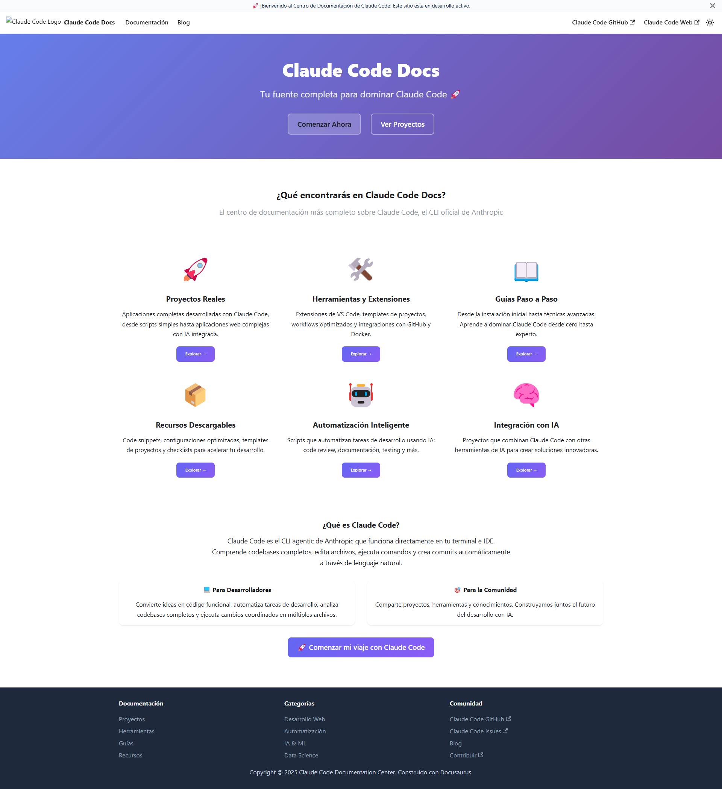

# Instalación de Claude Code

¡Bienvenido a la guía completa de instalación de Claude Code! En esta guía aprenderás a instalar y configurar Claude Code correctamente en tu sistema.


*Centro de Documentación Claude Code - Tu fuente completa para dominar el CLI de IA de Anthropic*

## 🎯 ¿Qué es Claude Code?

**Claude Code** es el CLI (Command Line Interface) oficial de Anthropic que permite:

- 💻 **Convertir ideas en código** usando lenguaje natural
- 🤖 **Entender codebases completos** automáticamente
- ⚡ **Editar archivos y ejecutar comandos** directamente
- 🔧 **Hacer cambios coordinados** en múltiples archivos
- 📊 **Crear commits automáticos** y trabajar con Git

## 📋 Requisitos del Sistema

### Requisitos Mínimos

- **Node.js**: Versión 18 o superior (requerido)
- **RAM**: 4GB (recomendado 8GB+)
- **Conexión a Internet**: Requerida constantemente
- **Sistema Operativo**: 
  - ✅ macOS 10.15+
  - ✅ Ubuntu 20.04 LTS+ / Debian 10+
  - ✅ Windows 10+ (con limitaciones)

### Requisitos Recomendados

- **RAM**: 16GB para proyectos grandes
- **SSD**: Para mejor rendimiento
- **Terminal moderno**: Windows Terminal, iTerm2, o similar

## 🚀 Métodos de Instalación

### Método 1: NPM (Recomendado)

Este es el método más confiable y fácil de mantener:

```bash
# Instalar globalmente
npm install -g @anthropic-ai/claude-code

# Verificar instalación
claude doctor

# Navegar a tu proyecto
cd tu-proyecto
claude
```

### Método 2: Instalación Binaria Nativa

#### Para macOS/Linux:
```bash
curl -fsSL https://claude.ai/install.sh | bash
```

#### Para Windows:
```powershell
irm https://claude.ai/install.ps1 | iex
```

:::tip Recomendación
Si tienes Node.js instalado, usa el **Método 1 (NPM)** ya que es más fácil de actualizar y gestionar.
:::

## 🔐 Configuración de Autenticación

### Paso 1: Primera Ejecución

Cuando ejecutes `claude` por primera vez:

```bash
cd tu-proyecto
claude
```

### Paso 2: Proceso OAuth

1. Se abrirá tu navegador automáticamente
2. Inicia sesión en tu cuenta de Anthropic
3. Autoriza la aplicación Claude Code
4. Regresa al terminal - ¡ya estás listo!

### Paso 3: Verificar Autenticación

```bash
claude doctor
```

Deberías ver algo como:
```
✅ Claude Code está instalado correctamente
✅ Autenticación válida
✅ Conexión exitosa con los servicios de Anthropic
```

## 💳 Planes y Suscripciones

### Plan Pro - $20/mes
- Claude Code incluido
- ~10-40 prompts cada 5 horas
- Solo modelo Sonnet 4
- **Ideal para**: Repositorios pequeños (menos de 1,000 líneas)

### Plan Max 5x - $100/mes  
- ~50-200 prompts cada 5 horas
- Modelos Sonnet 4 y Opus 4
- 140-280 horas Sonnet 4, 15-35 horas Opus 4

### Plan Max 20x - $200/mes
- ~200-800 prompts cada 5 horas  
- 240-480 horas Sonnet 4, 24-40 horas Opus 4
- **Ideal para**: Uso diario con bases de código grandes

:::warning Importante
Necesitas una suscripción **Pro o superior** para usar Claude Code. El plan gratuito no incluye acceso al CLI.
:::

## ✅ Verificación Post-Instalación

### Comando de Diagnóstico

```bash
claude doctor
```

### Salida Esperada

```bash
🔧 Claude Code Diagnostics

✅ Installation: Claude Code is installed
✅ Authentication: Valid session found  
✅ Connection: Successfully connected to Anthropic services
✅ Node.js: v18.17.0 (✓ Compatible)
✅ System: macOS Sonoma 14.2.1

🎯 Todo looks good! Ready to code with Claude.
```

### Tu Primer Comando

```bash
# Navegar a cualquier proyecto
cd mi-proyecto

# Iniciar Claude Code
claude

# Verás algo como:
# Claude Code v1.x.x
# Ready to help! What would you like to work on?
```

## 🛠️ Comandos Esenciales

### Comandos de Sistema
```bash
claude doctor          # Verificar instalación
claude update          # Actualizar a la última versión
claude --version       # Ver versión instalada
claude --help          # Mostrar ayuda
```

### Comandos Durante Uso
```bash
/clear                 # Limpiar contexto
/help                  # Ayuda disponible
ESC                    # Salir de Claude Code (NO uses Ctrl+C)
```

## ⚠️ Solución de Problemas Comunes

### Error: "Command not found: claude"

**Solución:**
```bash
# Verificar que Node.js esté instalado
node --version

# Reinstalar Claude Code
npm install -g @anthropic-ai/claude-code

# Verificar PATH
echo $PATH
```

### Error: "Authentication failed"

**Solución:**
1. Verificar que tienes una suscripción activa
2. Cerrar sesión y volver a autenticar:
```bash
claude logout
claude  # Esto iniciará un nuevo proceso de autenticación
```

### Error: "Permission denied" (Windows)

**Solución:**
```powershell
# Ejecutar como administrador
Set-ExecutionPolicy -ExecutionPolicy RemoteSigned -Scope CurrentUser

# O usar WSL/Git Bash en su lugar
```

### Error: "EACCES: permission denied" (Mac/Linux)

**Solución:**
```bash
# Arreglar permisos de npm
sudo chown -R $(whoami) ~/.npm

# O usar npx en su lugar
npx @anthropic-ai/claude-code
```

### Problemas de Rendimiento

- **Usa `/clear` frecuentemente** para limpiar contexto
- **Considera usar modelo Haiku** para tareas simples:
```bash
claude --model=haiku
```

## 🚀 Próximos Pasos

Una vez que tengas Claude Code instalado:

1. 📖 **Lee la guía de [Primeros Pasos](/docs/guias/primeros-pasos)** 
2. 🧠 **Aprende los [Conceptos Básicos](/docs/guias/conceptos-basicos)**
3. 💡 **Consulta las [Mejores Prácticas](/docs/guias/mejores-practicas)**
4. 🛠️ **Explora [Herramientas y Recursos](/docs/herramientas)**

## 📚 Recursos Adicionales

- **Documentación Oficial**: [docs.anthropic.com/claude-code](https://docs.anthropic.com/en/docs/claude-code)
- **Sitio Web**: [claude.ai/code](https://claude.ai/code)
- **Repositorio GitHub**: [github.com/anthropics/claude-code](https://github.com/anthropics/claude-code)
- **Consola Anthropic**: [console.anthropic.com](https://console.anthropic.com)

:::tip ¿Necesitas ayuda?
Si tienes problemas con la instalación, consulta nuestra [guía de troubleshooting](/docs/guias/troubleshooting) o únete a la comunidad en GitHub.
:::