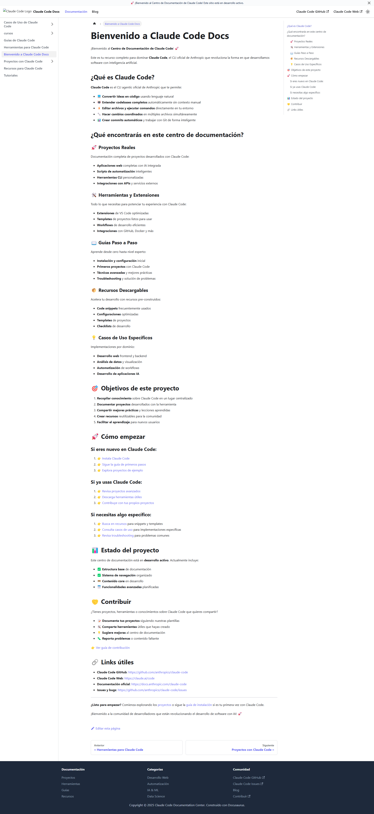

# Bienvenido a Claude Code Docs

¡Bienvenido al **Centro de Documentación de Claude Code**! 🚀

Este es tu recurso completo para dominar **Claude Code**, el CLI oficial de Anthropic que revoluciona la forma en que desarrollamos software con inteligencia artificial.

*Interfaz principal de la documentación organizada por categorías*

## ¿Qué es Claude Code?

**Claude Code** es el CLI agentic oficial de Anthropic que te permite:

- 💻 **Convertir ideas en código** usando lenguaje natural
- 🤖 **Entender codebases completos** automáticamente sin contexto manual
- ⚡ **Editar archivos y ejecutar comandos** directamente en tu entorno
- 🔧 **Hacer cambios coordinados** en múltiples archivos simultáneamente
- 📊 **Crear commits automáticos** y trabajar con Git de forma inteligente

## ¿Qué encontrarás en este centro de documentación?

### 🚀 Proyectos Reales
Documentación completa de proyectos desarrollados con Claude Code:
- **Aplicaciones web** completas con IA integrada
- **Scripts de automatización** inteligentes
- **Herramientas CLI** personalizadas
- **Integraciones con APIs** y servicios externos

### 🛠️ Herramientas y Extensiones
Todo lo que necesitas para potenciar tu experiencia con Claude Code:
- **Extensiones** de VS Code optimizadas
- **Templates** de proyectos listos para usar
- **Workflows** de desarrollo eficientes
- **Integraciones** con GitHub, Docker y más

### 📖 Guías Paso a Paso
Aprende desde cero hasta nivel experto:
- **Instalación y configuración** inicial
- **Primeros proyectos** con Claude Code
- **Técnicas avanzadas** y mejores prácticas
- **Troubleshooting** y solución de problemas

### 📦 Recursos Descargables
Acelera tu desarrollo con recursos pre-construidos:
- **Code snippets** frecuentemente usados
- **Configuraciones** optimizadas
- **Templates** de proyectos
- **Checklists** de desarrollo

### 💡 Casos de Uso Específicos
Implementaciones por dominio:
- **Desarrollo web** frontend y backend
- **Análisis de datos** y visualización
- **Automatización** de workflows
- **Desarrollo de aplicaciones IA**

## 🎯 Objetivos de este proyecto

1. **Recopilar conocimiento** sobre Claude Code en un lugar centralizado
2. **Documentar proyectos** desarrollados con la herramienta
3. **Compartir mejores prácticas** y lecciones aprendidas
4. **Crear recursos** reutilizables para la comunidad
5. **Facilitar el aprendizaje** para nuevos usuarios

## 🚀 Cómo empezar

### Si eres nuevo en Claude Code:
1. 👉 [Instala Claude Code](/docs/guias/instalacion)
2. 👉 [Sigue la guía de primeros pasos](/docs/guias/primeros-pasos)
3. 👉 [Explora proyectos de ejemplo](/docs/proyectos)

### Si ya usas Claude Code:
1. 👉 [Revisa proyectos avanzados](/docs/proyectos/ai-integration)
2. 👉 [Descarga herramientas útiles](/docs/herramientas)
3. 👉 [Contribuye con tus propios proyectos](/docs/guias/contribuir)

### Si necesitas algo específico:
1. 👉 [Busca en recursos](/docs/recursos) para snippets y templates
2. 👉 [Consulta casos de uso](/docs/casos-uso) para implementaciones específicas
3. 👉 [Revisa troubleshooting](/docs/guias/troubleshooting) para problemas comunes

## 📊 Estado del proyecto

Este centro de documentación está en **desarrollo activo**. Actualmente incluye:

- ✅ **Estructura base** de documentación
- ✅ **Sistema de navegación** organizado
- 🚧 **Contenido core** en desarrollo
- 📅 **Funcionalidades avanzadas** planificadas

## 🤝 Contribuir

¿Tienes proyectos, herramientas o conocimientos sobre Claude Code que quieres compartir?

- 📝 **Documenta tus proyectos** siguiendo nuestras plantillas
- 🛠️ **Comparte herramientas** útiles que hayas creado
- 💡 **Sugiere mejoras** al centro de documentación
- 🐛 **Reporta problemas** o contenido faltante

👉 [Ver guía de contribución](/docs/guias/contribuir)

## 🔗 Links útiles

- **Claude Code GitHub**: https://github.com/anthropics/claude-code
- **Claude Code Web**: https://claude.ai/code
- **Documentación oficial**: https://docs.anthropic.com/claude-code
- **Issues y bugs**: https://github.com/anthropics/claude-code/issues

---

**¿Listo para empezar?** Comienza explorando los [proyectos](/docs/proyectos) o sigue la [guía de instalación](/docs/guias/instalacion) si es tu primera vez con Claude Code.

¡Bienvenido a la comunidad de desarrolladores que están revolucionando el desarrollo de software con IA! 🚀